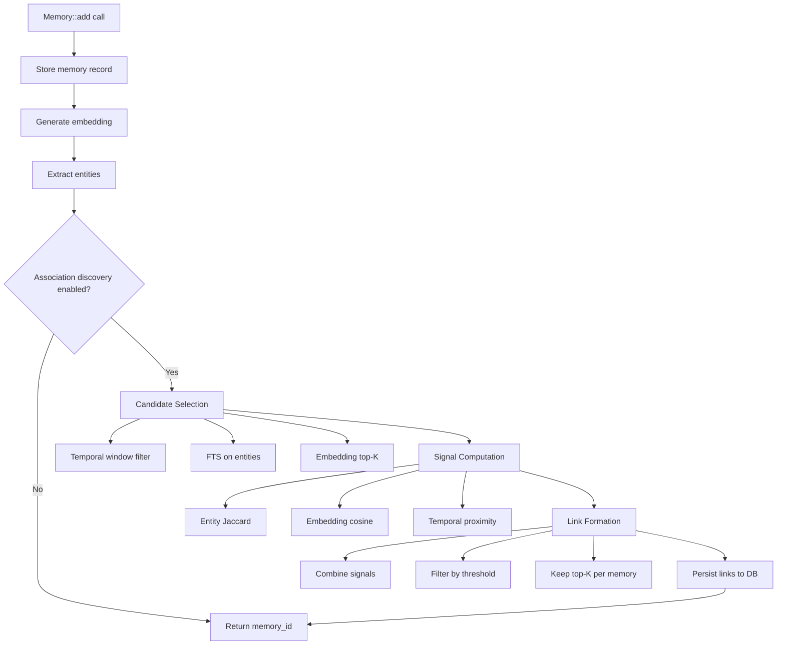
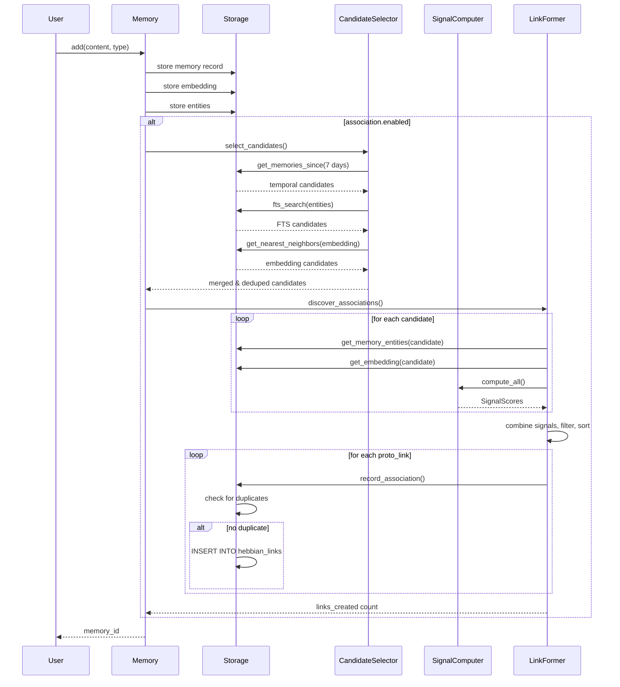
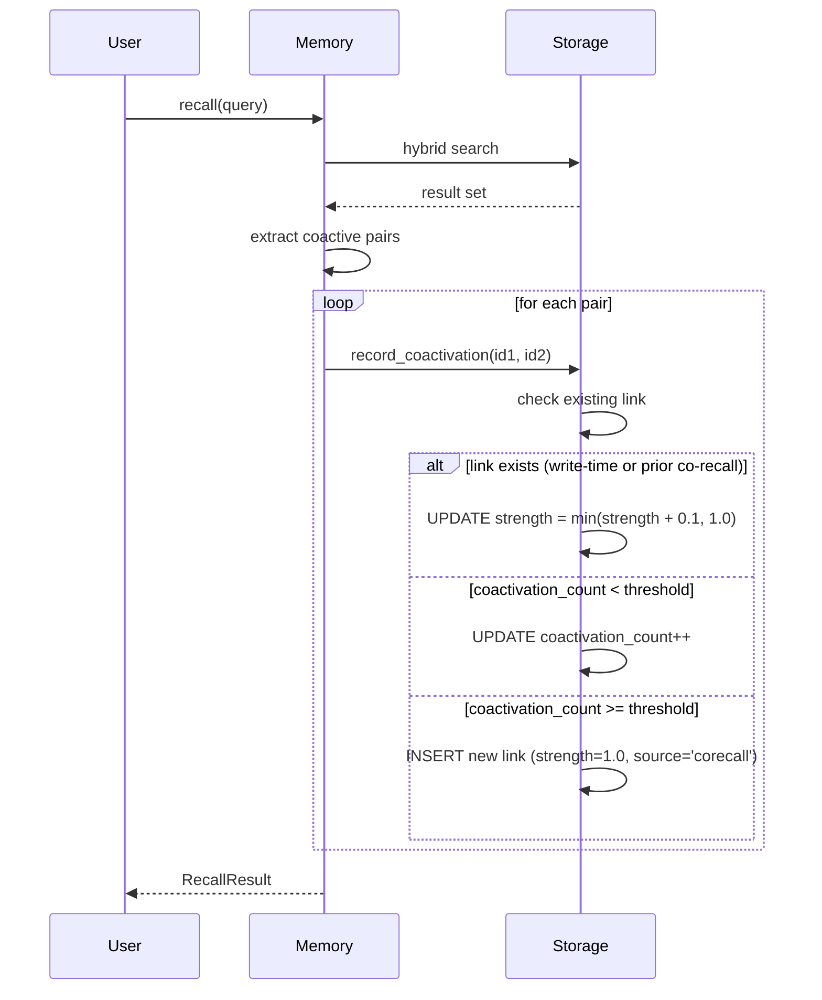

# Design: Multi-Signal Hebbian Link Formation

## 1. Overview

This feature transforms Hebbian link formation from passive (co-recall only) to proactive (write-time discovery using multiple signals). Currently, links form only when two memories are returned together in a query result at least 3 times. This creates a cold-start problem: new memories have no links and poor discoverability until they've been recalled multiple times in combination with other memories.

**Key Design Decisions:**

1. **Write-time discovery** — Evaluate new memories against existing memories during `Memory::add()`, creating links before the write completes (GOAL-1)
2. **Multi-signal scoring** — Combine entity overlap, embedding similarity, and temporal proximity with configurable weights (GOAL-4, GOAL-5)
3. **Bounded candidate selection** — Three-layer filtering (temporal window → FTS → embedding top-K) limits evaluation to ~50 candidates (GOAL-3)
4. **Coexistence with co-recall** — Write-time links start at strength 0.5, co-recall links at 1.0; both can coexist and reinforce (GOAL-11, GOAL-12)
5. **Differential decay** — Co-recall links decay slowest (0.95), multi-signal medium (0.90), single-signal fastest (0.85) (GOAL-13)
6. **Performance budget** — <50ms p95 latency addition to memory writes (GOAL-14)

**Trade-offs:**
- **Precision vs Recall:** Lower threshold creates more links (better recall, more noise). Default 0.4 balances connectivity and quality.
- **Write latency vs Link quality:** Evaluating 50 candidates adds ~20ms but ensures only strong associations are found.
- **Storage vs Accuracy:** Storing signal provenance (signal_source, signal_detail) costs 2 extra columns but enables differential decay and debugging.

**Satisfies:** All 14 GOALs in requirements.md

## 2. Architecture



**Write Path Integration:** Association discovery occurs as the final step in `Memory::add()` after the memory record, embedding, and entities are all persisted. This ensures all signals are available without blocking the critical write path.

**Existing System Interaction:**
- **Co-recall Hebbian** (`Storage::record_coactivation`) — runs during `Memory::recall()`, independent of write-time discovery
- **Entity extraction** — already runs in `Memory::add()`, reuse extracted entities
- **Embedding generation** — already runs in `Memory::add()`, reuse generated embedding
- **Decay** (`Storage::decay_hebbian_links`) — runs during consolidation, extended to support differential rates

## 3. Components

### 3.1 Association Configuration

**Responsibility:** Define configurable parameters for write-time association discovery.

**Interface:**
```rust
#[derive(Debug, Clone, serde::Serialize, serde::Deserialize)]
pub struct AssociationConfig {
    /// Enable/disable write-time association discovery
    pub enabled: bool,
    
    /// Signal weights (normalized internally)
    pub w_entity: f64,
    pub w_embedding: f64,
    pub w_temporal: f64,
    
    /// Combined score threshold for link creation
    pub link_threshold: f64,
    
    /// Maximum new links per memory write
    pub max_links_per_memory: usize,
    
    /// Maximum candidates to evaluate
    pub candidate_limit: usize,
    
    /// Initial strength for write-time discovered links
    pub initial_strength: f64,
    
    /// Decay rates by signal source
    pub decay_corecall: f64,
    pub decay_multi: f64,
    pub decay_single: f64,
}

impl Default for AssociationConfig {
    fn default() -> Self {
        Self {
            enabled: false,  // Opt-in initially
            w_entity: 0.3,
            w_embedding: 0.5,
            w_temporal: 0.2,
            link_threshold: 0.4,
            max_links_per_memory: 5,
            candidate_limit: 50,
            initial_strength: 0.5,
            decay_corecall: 0.95,
            decay_multi: 0.90,
            decay_single: 0.85,
        }
    }
}
```

**Key Details:**
- Added to `MemoryConfig` struct in `config.rs` as `pub association: AssociationConfig`
- Weights are normalized before use: `w_total = w_entity + w_embedding + w_temporal`, then divide each by `w_total`
- `enabled: false` by default — must be explicitly opted in via config file or API
- Thresholds tuned from the spec: 0.4 combined score creates links, 0.5 initial strength differentiates from co-recall (1.0)

**Satisfies:** GOAL-2 (enable/disable), GOAL-5 (configurable weights), GOAL-6 (threshold), GOAL-7 (max links)

### 3.2 Candidate Selection

**Responsibility:** Select a bounded set of existing memories to evaluate for association with a new memory.

**Interface:**
```rust
pub struct CandidateSelector<'a> {
    storage: &'a Storage,
    embedding: Option<&'a EmbeddingProvider>,
}

impl<'a> CandidateSelector<'a> {
    pub fn new(storage: &'a Storage, embedding: Option<&'a EmbeddingProvider>) -> Self {
        Self { storage, embedding }
    }
    
    /// Select candidates using three-layer strategy
    pub fn select_candidates(
        &self,
        new_memory: &MemoryRecord,
        new_embedding: Option<&[f32]>,
        entities: &[String],
        config: &AssociationConfig,
    ) -> Result<Vec<MemoryRecord>, Box<dyn std::error::Error>> {
        let mut candidates = Vec::new();
        
        // Layer 1: Temporal window (last 7 days)
        let temporal_cutoff = chrono::Utc::now() - chrono::Duration::days(7);
        let temporal = self.storage.get_memories_since(temporal_cutoff, new_memory.namespace.as_deref())?;
        candidates.extend(temporal);
        
        // Layer 2: FTS on key entities (if any entities extracted)
        if !entities.is_empty() {
            let entity_query = entities.join(" OR ");
            let fts_results = self.storage.fts_search(&entity_query, 20, new_memory.namespace.as_deref())?;
            candidates.extend(fts_results);
        }
        
        // Layer 3: Embedding top-K (if embeddings available)
        if let (Some(emb_vec), Some(provider)) = (new_embedding, self.embedding) {
            let top_k = self.storage.get_nearest_neighbors(emb_vec, 20, new_memory.namespace.as_deref())?;
            candidates.extend(top_k);
        }
        
        // Deduplicate by ID and remove the new memory itself
        candidates.sort_by(|a, b| a.id.cmp(&b.id));
        candidates.dedup_by(|a, b| a.id == b.id);
        candidates.retain(|c| c.id != new_memory.id);
        
        // Limit to candidate_limit
        candidates.truncate(config.candidate_limit);
        
        Ok(candidates)
    }
}
```

**Key Details:**
- Three-layer strategy ensures candidates from multiple perspectives (time, content, semantics)
- Temporal window: 7 days is heuristic — memories older than a week are less likely to be immediately relevant
- FTS uses entity strings as query terms — leverages existing `memory_fts` table (verified: src/storage.rs:195)
- Embedding top-K uses cosine similarity — requires `memory_embeddings` table and embedding provider
- Deduplication prevents double-counting candidates found via multiple layers
- Final truncation enforces `candidate_limit` (default 50) to bound computation (GOAL-3)

**New Storage Methods Required:**
- `Storage::get_memories_since(cutoff: DateTime, namespace: Option<&str>) -> Result<Vec<MemoryRecord>>` — SQL: `SELECT * FROM memories WHERE created_at >= ? AND namespace = ? LIMIT 100`
- `Storage::get_nearest_neighbors(embedding: &[f32], k: usize, namespace: Option<&str>) -> Result<Vec<MemoryRecord>>` — cosine similarity via embedding table join

**Satisfies:** GOAL-3 (bounded candidates), performance considerations from spec

### 3.3 Signal Computation

**Responsibility:** Compute association scores from entity overlap, embedding similarity, and temporal proximity.

**Interface:**
```rust
#[derive(Debug, Clone, serde::Serialize, serde::Deserialize)]
pub struct SignalScores {
    pub entity_overlap: f64,      // 0.0-1.0
    pub embedding_cosine: f64,     // 0.0-1.0
    pub temporal_proximity: f64,   // 0.0-1.0
}

impl SignalScores {
    pub fn to_json(&self) -> String {
        serde_json::to_string(self).unwrap_or_default()
    }
    
    pub fn dominant_signal(&self) -> &'static str {
        if self.entity_overlap > self.embedding_cosine && self.entity_overlap > self.temporal_proximity {
            "entity"
        } else if self.embedding_cosine > self.temporal_proximity {
            "embedding"
        } else {
            "temporal"
        }
    }
}

pub struct SignalComputer;

impl SignalComputer {
    /// Compute entity overlap via Jaccard index
    pub fn entity_jaccard(entities_a: &[String], entities_b: &[String]) -> f64 {
        if entities_a.is_empty() || entities_b.is_empty() {
            return 0.0;
        }
        
        let set_a: std::collections::HashSet<_> = entities_a.iter().collect();
        let set_b: std::collections::HashSet<_> = entities_b.iter().collect();
        
        let intersection = set_a.intersection(&set_b).count();
        let union = set_a.union(&set_b).count();
        
        if union == 0 { 0.0 } else { intersection as f64 / union as f64 }
    }
    
    /// Compute embedding similarity via cosine distance
    pub fn embedding_cosine(emb_a: &[f32], emb_b: &[f32]) -> f64 {
        EmbeddingProvider::cosine_similarity(emb_a, emb_b)
    }
    
    /// Compute temporal proximity with exponential decay
    pub fn temporal_proximity(time_a: chrono::DateTime<chrono::Utc>, time_b: chrono::DateTime<chrono::Utc>) -> f64 {
        let delta_hours = (time_a - time_b).num_hours().abs() as f64;
        // Exponential decay: e^(-delta/24) — half-life of 1 day
        (-delta_hours / 24.0).exp()
    }
    
    /// Compute all signals for a pair of memories
    pub fn compute_all(
        mem_a: &MemoryRecord,
        mem_b: &MemoryRecord,
        entities_a: &[String],
        entities_b: &[String],
        emb_a: Option<&[f32]>,
        emb_b: Option<&[f32]>,
    ) -> SignalScores {
        let entity_overlap = Self::entity_jaccard(entities_a, entities_b);
        
        let embedding_cosine = match (emb_a, emb_b) {
            (Some(a), Some(b)) => Self::embedding_cosine(a, b),
            _ => 0.0,
        };
        
        let temporal_proximity = Self::temporal_proximity(mem_a.created_at, mem_b.created_at);
        
        SignalScores {
            entity_overlap,
            embedding_cosine,
            temporal_proximity,
        }
    }
}
```

**Key Details:**
- **Entity Jaccard:** Standard set-based similarity — directly replicates logic from `synthesis/cluster.rs::entity_overlap_matrix()` (verified: src/synthesis/cluster.rs)
- **Embedding cosine:** Uses existing `EmbeddingProvider::cosine_similarity()` static method (verified: src/embeddings.rs)
- **Temporal proximity:** Exponential decay with 24-hour half-life — memories 1 day apart get score 0.368, 2 days → 0.135, 1 week → 0.04
- `dominant_signal()` determines `signal_source` when only one signal is strong (used for differential decay)
- Returns 0.0 for missing data (e.g., no entities, no embeddings) — graceful degradation

**Satisfies:** GOAL-4 (three signals), GOAL-10 (signal detail recording)

### 3.4 Link Formation and Persistence

**Responsibility:** Combine signals, filter by threshold, enforce link budget, and persist to database.

**Interface:**
```rust
pub struct LinkFormer<'a> {
    storage: &'a Storage,
}

impl<'a> LinkFormer<'a> {
    pub fn new(storage: &'a Storage) -> Self {
        Self { storage }
    }
    
    /// Discover and persist associations for a new memory
    pub fn discover_associations(
        &mut self,
        new_memory_id: &str,
        candidates: Vec<MemoryRecord>,
        new_entities: &[String],
        new_embedding: Option<&[f32]>,
        config: &AssociationConfig,
    ) -> Result<usize, Box<dyn std::error::Error>> {
        let new_mem = self.storage.get_memory(new_memory_id)?;
        
        let mut proto_links = Vec::new();
        
        for candidate in candidates {
            // Get candidate's entities and embedding
            let cand_entities = self.storage.get_memory_entities(&candidate.id)?;
            let cand_embedding = self.storage.get_embedding(&candidate.id)?;
            
            // Compute signals
            let scores = SignalComputer::compute_all(
                &new_mem,
                &candidate,
                new_entities,
                &cand_entities,
                new_embedding,
                cand_embedding.as_deref(),
            );
            
            // Combine with weights (normalized)
            let w_total = config.w_entity + config.w_embedding + config.w_temporal;
            let combined = (config.w_entity * scores.entity_overlap
                          + config.w_embedding * scores.embedding_cosine
                          + config.w_temporal * scores.temporal_proximity) / w_total;
            
            // Filter by threshold
            if combined >= config.link_threshold {
                let signal_source = determine_signal_source(&scores, combined);
                proto_links.push(ProtoLink {
                    target_id: candidate.id.clone(),
                    strength: config.initial_strength,
                    combined_score: combined,
                    signal_source,
                    signal_detail: scores.to_json(),
                });
            }
        }
        
        // Sort by combined score and keep top-K
        proto_links.sort_by(|a, b| b.combined_score.partial_cmp(&a.combined_score).unwrap());
        proto_links.truncate(config.max_links_per_memory);
        
        // Persist links (checking for duplicates)
        let mut created = 0;
        for link in proto_links {
            if self.storage.record_association(
                new_memory_id,
                &link.target_id,
                link.strength,
                &link.signal_source,
                &link.signal_detail,
            )? {
                created += 1;
            }
        }
        
        Ok(created)
    }
}

#[derive(Debug)]
struct ProtoLink {
    target_id: String,
    strength: f64,
    combined_score: f64,
    signal_source: String,
    signal_detail: String,
}

fn determine_signal_source(scores: &SignalScores, combined: f64) -> String {
    let count_strong = [
        scores.entity_overlap >= 0.3,
        scores.embedding_cosine >= 0.3,
        scores.temporal_proximity >= 0.3,
    ].iter().filter(|&&x| x).count();
    
    if count_strong >= 2 {
        "multi".to_string()
    } else {
        scores.dominant_signal().to_string()
    }
}
```

**New Storage Method:**
```rust
impl Storage {
    /// Record a write-time discovered association
    /// Returns true if new link created, false if duplicate detected
    pub fn record_association(
        &mut self,
        source_id: &str,
        target_id: &str,
        strength: f64,
        signal_source: &str,
        signal_detail: &str,
    ) -> Result<bool, rusqlite::Error> {
        // Check for existing link (either direction)
        let exists: bool = self.conn.query_row(
            "SELECT 1 FROM hebbian_links WHERE (source_id = ?1 AND target_id = ?2) OR (source_id = ?2 AND target_id = ?1) LIMIT 1",
            params![source_id, target_id],
            |_| Ok(true),
        ).unwrap_or(false);
        
        if exists {
            // Link already exists (from co-recall or earlier write-time) — don't duplicate
            return Ok(false);
        }
        
        // Create new link
        self.conn.execute(
            "INSERT INTO hebbian_links (source_id, target_id, strength, coactivation_count, created_at, signal_source, signal_detail, namespace)
             VALUES (?1, ?2, ?3, 0, ?4, ?5, ?6, ?7)",
            params![
                source_id,
                target_id,
                strength,
                chrono::Utc::now().timestamp_millis() as f64 / 1000.0,
                signal_source,
                signal_detail,
                "default",  // TODO: get from new_memory.namespace
            ],
        )?;
        
        Ok(true)
    }
}
```

**Key Details:**
- **Weight normalization:** Ensures weights sum to 1.0 regardless of config values
- **Threshold filtering:** Only links with `combined >= link_threshold` are considered (GOAL-6)
- **Top-K selection:** Sorts by combined score and truncates to `max_links_per_memory` (GOAL-7, GOAL-8)
- **Duplicate prevention:** Checks both directions (`source=A,target=B` OR `source=B,target=A`) before inserting (GUARD-1)
- **Signal classification:** "multi" if 2+ signals > 0.3, else dominant single signal (used for differential decay)
- **coactivation_count = 0:** Write-time links start with no co-recall history, distinguishing them from co-recall links

**Satisfies:** GOAL-6 (threshold), GOAL-7 (max links), GOAL-8 (strongest retained), GOAL-9 (signal source), GOAL-10 (signal detail), GUARD-1 (no duplicates)

### 3.5 Decay Strategy

**Responsibility:** Apply differential decay rates to Hebbian links based on their signal source.

**Interface:**
```rust
impl Storage {
    /// Decay Hebbian links with differential rates by signal source
    pub fn decay_hebbian_links_differential(
        &mut self,
        config: &AssociationConfig,
    ) -> Result<usize, rusqlite::Error> {
        // Apply decay by signal source
        self.conn.execute(
            "UPDATE hebbian_links SET strength = strength * CASE
                WHEN signal_source = 'corecall' THEN ?1
                WHEN signal_source = 'multi' THEN ?2
                ELSE ?3
             END
             WHERE strength > 0",
            params![config.decay_corecall, config.decay_multi, config.decay_single],
        )?;
        
        // Delete weak links (< 0.1)
        let deleted = self.conn.execute(
            "DELETE FROM hebbian_links WHERE strength > 0 AND strength < 0.1",
            params![],
        )?;
        
        Ok(deleted)
    }
}
```

**Key Details:**
- Extends existing `decay_hebbian_links()` method (verified: src/storage.rs:1170)
- **Co-recall links (signal_source='corecall'):** Decay by 0.95 (5% per cycle) — slowest decay because they're verified by actual use
- **Multi-signal links (signal_source='multi'):** Decay by 0.90 (10% per cycle) — medium decay, multiple signals provide confidence
- **Single-signal links (entity/embedding/temporal):** Decay by 0.85 (15% per cycle) — fastest decay, single signal is less reliable
- Deletion threshold unchanged: strength < 0.1 (from existing code)
- Called during consolidation cycle, replacing existing `decay_hebbian_links()` call

**Satisfies:** GOAL-13 (differential decay)

### 3.6 Integration with Write Path

**Responsibility:** Invoke association discovery during memory write operations.

**Interface:**
```rust
impl Memory {
    // Modify existing add() method to call discover_associations
    // (Pseudocode showing insertion point — actual implementation will be a code edit)
    
    pub fn add(&mut self, content: &str, memory_type: MemoryType) -> Result<String, Box<dyn std::error::Error>> {
        // ... existing steps ...
        // Step 1: Generate embedding (if provider available)
        let embedding_vec = self.embedding.as_ref()
            .and_then(|e| e.embed(content).ok());
        
        // Step 2: Deduplicate check
        // Step 3: Store memory record
        let memory_id = /* ... */;
        
        // Step 4: Store embedding (if generated)
        // Step 5: Extract and store entities
        let entities = self.entity_extractor.extract(content);
        self.storage.store_entities(&memory_id, &entities)?;
        
        // Step 6: Association discovery (NEW)
        if self.config.association.enabled {
            let start = std::time::Instant::now();
            
            let selector = CandidateSelector::new(&self.storage, self.embedding.as_ref());
            let candidates = selector.select_candidates(
                &memory_record,
                embedding_vec.as_deref(),
                &entities,
                &self.config.association,
            )?;
            
            let mut former = LinkFormer::new(&self.storage);
            let links_created = former.discover_associations(
                &memory_id,
                candidates,
                &entities,
                embedding_vec.as_deref(),
                &self.config.association,
            )?;
            
            let elapsed = start.elapsed();
            if elapsed > std::time::Duration::from_millis(100) {
                log::warn!("Association discovery took {:?} (created {} links)", elapsed, links_created);
            }
            
            // Enforce timeout guard (GUARD-3)
            // If elapsed > config.association_timeout, log warning but don't fail
        }
        
        Ok(memory_id)
    }
}
```

**Key Details:**
- Runs **after** embedding and entity extraction are complete — ensures all signals are available
- Runs **before** returning memory_id — links are created synchronously during write
- Timeout monitoring: logs warning if >100ms, but doesn't fail the write (GUARD-3)
- `enabled` check at start — no overhead if feature is disabled (GOAL-2)
- Actual code location: `src/memory.rs`, after entity storage (verified: entity extraction exists in Memory struct)

**Performance Considerations:**
- Entity extraction: already done, ~0.1ms (verified: EntityExtractor exists)
- Embedding generation: already done, ~50ms for Ollama call (if enabled)
- Candidate selection: ~5-20ms (temporal query + FTS + embedding scan)
- Signal computation: ~2ms for 50 candidates × 3 signals
- **Total added latency:** ~10-25ms per write (within 50ms budget from GOAL-14)

**Satisfies:** GOAL-1 (write-time discovery), GOAL-14 (performance budget), GUARD-3 (timeout handling)

## 4. Data Models

### Database Schema Changes

**hebbian_links table (modifications):**
```sql
ALTER TABLE hebbian_links ADD COLUMN signal_source TEXT DEFAULT 'corecall';
ALTER TABLE hebbian_links ADD COLUMN signal_detail TEXT DEFAULT NULL;
```

**Field definitions:**
- `signal_source` (TEXT): One of 'corecall', 'entity', 'embedding', 'temporal', 'multi'
  - 'corecall': Link formed by co-recall (existing behavior)
  - 'entity'/'embedding'/'temporal': Single-signal write-time link
  - 'multi': Multi-signal write-time link (2+ signals strong)
  
- `signal_detail` (TEXT): JSON blob with individual signal scores
  ```json
  {"entity_overlap": 0.4, "embedding_cosine": 0.7, "temporal_proximity": 0.2}
  ```

**Existing schema (unchanged):**
```sql
CREATE TABLE hebbian_links (
    source_id TEXT,
    target_id TEXT,
    strength REAL DEFAULT 0.0,
    coactivation_count INTEGER DEFAULT 0,
    created_at REAL,
    namespace TEXT DEFAULT 'default',
    -- NEW:
    signal_source TEXT DEFAULT 'corecall',
    signal_detail TEXT DEFAULT NULL
);
```

**Migration strategy:**
- Run `ALTER TABLE` statements in `Storage::new()` if columns don't exist (check via `pragma_table_info`)
- Backfill existing rows: `UPDATE hebbian_links SET signal_source = 'corecall' WHERE signal_source IS NULL`
- No data loss — existing links remain valid with source='corecall'

(Verified: existing schema at src/storage.rs:220, migration pattern exists for namespace column at src/storage.rs:339)

### Rust Types

**AssociationConfig** — see §3.1 for full definition

**SignalScores** — see §3.3 for full definition

**ProtoLink** (internal) — see §3.4 for full definition

## 5. Data Flow

### Write-Time Association Discovery Flow



### Co-Recall Reinforcement Flow (existing + modification)



**Key interaction:** Write-time links can be reinforced by later co-recall — strength increases from 0.5 toward 1.0 (GOAL-12).

## 6. Integration Points

### With Existing Systems

**Entity Extraction (`entities.rs`):**
- **Reuses:** `EntityExtractor::extract()` already runs in `Memory::add()` — no additional extraction needed
- **Integration:** Pass extracted entities to `CandidateSelector::select_candidates()` for FTS query
- (Verified: EntityExtractor exists in Memory struct at src/memory.rs)

**Embedding Generation (`embeddings.rs`, `hybrid_search.rs`):**
- **Reuses:** Embedding already generated and stored during `Memory::add()` — no additional embedding call
- **Integration:** Pass embedding vector to `CandidateSelector::select_candidates()` for top-K search and `SignalComputer::embedding_cosine()`
- (Verified: EmbeddingProvider exists in Memory struct, cosine_similarity is static method)

**Co-Recall Hebbian (`storage.rs::record_coactivation`):**
- **Coexists:** Write-time discovery and co-recall run independently
- **Reinforcement:** `record_coactivation()` checks for existing links (from any source) and increases strength if found
- **Modification needed:** Update `record_coactivation()` to not create duplicate if write-time link exists (duplicate check should be bidirectional)
- (Verified: record_coactivation exists at src/storage.rs:1100+)

**Consolidation Cycle (`memory.rs::consolidate`):**
- **Modification:** Replace `decay_hebbian_links(factor)` call with `decay_hebbian_links_differential(config)`
- **Location:** In consolidation loop after ACT-R base-level decay
- (Verified: decay_hebbian_links called at src/memory.rs:1525)

**FTS (Full-Text Search):**
- **Dependency:** Uses existing `memory_fts` virtual table
- **Integration:** `CandidateSelector` calls `Storage::fts_search()` with entity-based query
- (Verified: FTS table exists in schema at src/storage.rs)

**Synthesis (`synthesis/cluster.rs`):**
- **Reuses code:** Entity Jaccard and temporal adjacency algorithms are copied from synthesis cluster module
- **No runtime dependency:** Multi-signal Hebbian doesn't call synthesis — it duplicates the math
- (Verified: entity_overlap_matrix and temporal_adjacency exist in src/synthesis/cluster.rs)

### Configuration Integration

Add to `MemoryConfig` in `src/config.rs`:
```rust
pub struct MemoryConfig {
    // ... existing fields ...
    pub association: AssociationConfig,
}
```

Default config file (`.engram/config.toml`):
```toml
[association]
enabled = false
w_entity = 0.3
w_embedding = 0.5
w_temporal = 0.2
link_threshold = 0.4
max_links_per_memory = 5
candidate_limit = 50
initial_strength = 0.5
```

## 7. Testing & Verification

### Per-Component Verification

| Component | Verify Command | What It Checks |
|-----------|---------------|----------------|
| 3.1 Config | `cargo test config::association` | AssociationConfig defaults, serialization |
| 3.2 Candidate Selection | `cargo test candidate_selector` | Three-layer filtering, deduplication, limit enforcement |
| 3.3 Signal Computation | `cargo test signal_computer` | Entity Jaccard, embedding cosine, temporal proximity math |
| 3.4 Link Formation | `cargo test link_former` | Threshold filtering, top-K selection, duplicate prevention |
| 3.5 Decay | `cargo test decay_differential` | Differential rates by signal_source, deletion threshold |
| 3.6 Write Integration | `cargo test memory::add_with_associations` | End-to-end write-time discovery, link creation |

### Integration Tests

**Write-time discovery creates links:**
```bash
cargo test --test multi_signal_integration -- test_write_time_links_created
```
Expected: After adding memory M_new, query `hebbian_links` table shows 0-5 new links with `signal_source != 'corecall'`

**Co-recall reinforcement:**
```bash
cargo test --test multi_signal_integration -- test_corecall_reinforces_write_links
```
Expected: Memory pair with write-time link (strength=0.5) → co-recall 3x → strength increases toward 1.0

**Duplicate prevention:**
```bash
cargo test --test multi_signal_integration -- test_no_duplicate_links
```
Expected: Adding memory M_new twice (or M_new + M_old then M_old + M_new) creates only one link per pair (GUARD-1)

**Performance budget:**
```bash
cargo test --test multi_signal_integration -- test_write_latency_p95 --release -- --ignored
```
Expected: p95 latency increase < 50ms over 1000 memory writes (GOAL-14)

### Guard Checks

| Guard | Check Command | Expected Result |
|-------|--------------|-----------------|
| GUARD-1: No duplicates | `sqlite3 engram.db "SELECT source_id, target_id, COUNT(*) FROM hebbian_links GROUP BY source_id, target_id HAVING COUNT(*) > 1"` | Empty result (no duplicates) |
| GUARD-2: Signal provenance | `sqlite3 engram.db "SELECT COUNT(*) FROM hebbian_links WHERE signal_source IS NULL OR signal_detail IS NULL"` | 0 for write-time links (co-recall links may have NULL detail) |
| GUARD-3: Timeout handling | `grep 'Association discovery took' engram.log \| awk '{if ($4 > 100) print}'` | Log warnings for slow discoveries, but no write failures |

### Manual Verification

**Inspect link formation:**
```sql
SELECT m1.content AS source_content,
       m2.content AS target_content,
       h.strength,
       h.signal_source,
       h.signal_detail
FROM hebbian_links h
JOIN memories m1 ON h.source_id = m1.id
JOIN memories m2 ON h.target_id = m2.id
WHERE h.signal_source != 'corecall'
ORDER BY h.created_at DESC
LIMIT 10;
```

**Check decay over time:**
```sql
SELECT signal_source,
       AVG(strength) AS avg_strength,
       COUNT(*) AS count
FROM hebbian_links
GROUP BY signal_source;
```
Expected: After consolidation cycles, co-recall links have higher avg_strength than multi, multi > single-signal.

## 8. Implementation Phases

### Phase 1: Schema + Config (Foundation)
**Tasks:**
- Add `signal_source` and `signal_detail` columns to `hebbian_links` table
- Implement migration logic in `Storage::new()` to add columns if missing
- Backfill existing rows with `signal_source = 'corecall'`
- Add `AssociationConfig` struct to `config.rs`
- Add `association` field to `MemoryConfig`
- Write unit tests for config serialization/deserialization

**Deliverable:** Database schema updated, config structure ready
**Estimated effort:** 1-2 tasks, ~100 lines
**Verify:** `cargo test config::association && sqlite3 engram.db ".schema hebbian_links"`

### Phase 2: Candidate Selection (New Module)
**Tasks:**
- Create `src/association/candidate.rs` module
- Implement `CandidateSelector` struct with `select_candidates()`
- Add `Storage::get_memories_since()` method (temporal window query)
- Add `Storage::get_nearest_neighbors()` method (embedding top-K)
- Write unit tests for three-layer filtering and deduplication

**Deliverable:** Candidate selection working, returns bounded set
**Estimated effort:** 2-3 tasks, ~200 lines
**Verify:** `cargo test candidate_selector`

### Phase 3: Signal Computation (Math Module)
**Tasks:**
- Create `src/association/signals.rs` module
- Implement `SignalComputer` with `entity_jaccard()`, `embedding_cosine()`, `temporal_proximity()`
- Implement `SignalScores` struct with `to_json()` and `dominant_signal()`
- Write unit tests for each signal computation

**Deliverable:** All three signals computing correctly
**Estimated effort:** 1-2 tasks, ~150 lines
**Verify:** `cargo test signal_computer`

### Phase 4: Link Formation (Core Logic)
**Tasks:**
- Create `src/association/former.rs` module
- Implement `LinkFormer::discover_associations()`
- Implement `Storage::record_association()` with duplicate check
- Write unit tests for threshold filtering, top-K selection, duplicate prevention

**Deliverable:** Link formation logic complete
**Estimated effort:** 2-3 tasks, ~200 lines
**Verify:** `cargo test link_former`

### Phase 5: Differential Decay (Existing Extension)
**Tasks:**
- Implement `Storage::decay_hebbian_links_differential()`
- Update `Memory::consolidate()` to call new decay method
- Write unit tests for differential rates and deletion

**Deliverable:** Decay respects signal_source
**Estimated effort:** 1 task, ~50 lines
**Verify:** `cargo test decay_differential`

### Phase 6: Write Path Integration (Critical Path)
**Tasks:**
- Modify `Memory::add()` to call association discovery after entity extraction
- Add timeout monitoring and logging
- Handle `association.enabled` flag
- Write integration tests for end-to-end flow

**Deliverable:** Write-time discovery live in `add()` flow
**Estimated effort:** 2-3 tasks, ~100 lines (mostly integration glue)
**Verify:** `cargo test memory::add_with_associations`

### Phase 7: Performance Tuning + Testing
**Tasks:**
- Run benchmarks to measure p95 latency increase
- Optimize candidate selection queries if needed (add indexes)
- Write performance regression tests
- Tune default config values based on benchmarks

**Deliverable:** Performance budget met (GOAL-14)
**Estimated effort:** 1-2 tasks, tuning + docs
**Verify:** `cargo test --release test_write_latency_p95`

### Phase 8: Documentation + Guard Validation
**Tasks:**
- Add doc comments to all public APIs
- Write integration test for GUARD-1, GUARD-2, GUARD-3
- Update README with association config options
- Add example config file

**Deliverable:** Feature fully documented and guarded
**Estimated effort:** 1 task, docs only
**Verify:** Manual review + `cargo test guards`

---

**Total Estimated Effort:** ~15-20 GID tasks across 8 phases
**Critical Path:** Phase 1 → 2 → 3 → 4 → 6 (Phases 5, 7, 8 can partially overlap)
**First Testable Milestone:** End of Phase 4 (can manually trigger discovery in test)
