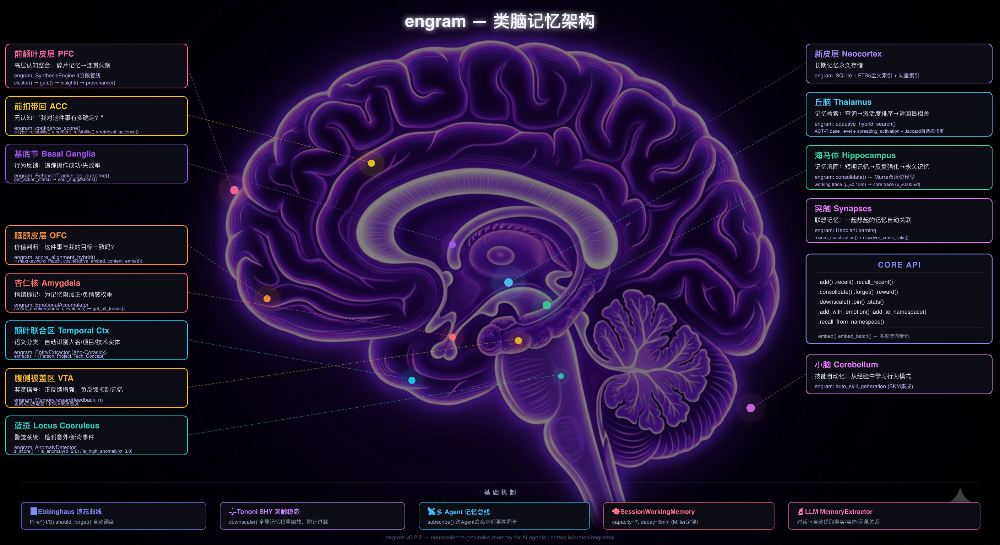

<div align="center">

# Engram — 为 AI 智能体打造的认知基底

[](https://crates.io/crates/engramai)
[](https://docs.rs/engramai)
[](https://www.gnu.org/licenses/agpl-3.0)

**中文 | [English](README.md)**

<br>



<br>

*基于神经科学的认知基底 — 记忆、情绪、内感受、洞察*

*纯 Rust · 单 SQLite 文件 · 无外部服务*

</div>

---

Engram 是一个为 AI 智能体打造的**认知基底（cognitive substrate）** — 让 LLM 拥有「记得住、感受得到、能成长」的底层机器。不是向量数据库的包装。不是 RAG 库。而是一个建模生物认知运作方式的统一存储与计算层。

**记忆是基础。** 基于已发表的认知科学模型（ACT-R 激活、Ebbinghaus 遗忘曲线、Hebbian + STDP 关联学习、双轨整合）—— 而不是向量相似度。最终效果：高频使用的知识保持可及，不用的记忆自然淡忘，相关概念互相强化，跨经验的模式自动浮现为洞察。

**记忆只是基底上的一个子系统。** 在同一个基底上，Engram 还承载了：

- 🧠 **Memory（记忆）** — ACT-R 激活、Ebbinghaus 衰减、Hebbian + STDP 关联学习、双轨整合
- 💚 **Emotional bus（情绪总线）** — 按领域的情感效价追踪、驱动对齐评分、行为反馈、跨智能体订阅
- 🧬 **Interoceptive hub（内感受中枢）** — 异稳态负荷、能量预算、身体状态调节信号
- ✨ **Synthesis engine（合成引擎）** — 从记忆聚类中自动提炼洞察，全程可追溯
- 🤝 **多智能体协作** — 共享基底 + 命名空间隔离

---

## 从神经科学到代码

Engram 不是「受神经科学启发」— 它实现了具体的、已发表的认知模型。每个机制都直接映射到生物学对应物：

| 🧠 大脑 | ⚙️ Engram |
|---|---|
| **前额叶皮层** — "现在什么是相关的？" | **ACT-R 激活模型** — 频率 × 近因评分 |
| **海马体衰减** — "用进废退" | **Ebbinghaus 遗忘曲线** — 指数衰减 + 间隔重复 |
| **突触可塑性** — "一起放电，一起连接" | **Hebbian 学习** — 共同回忆建立双向关联链接 |
| **STDP 时序依赖可塑性** — "顺序编码因果" | **STDP 时序排列** — A 在 B 之前 → 方向性链接增强 |
| **睡眠整合** — 海马体 → 新皮层 | **双轨整合** — "睡眠"周期：重播强记忆，衰减弱记忆 |
| **突触稳态** (Turrigiano 2008) | **稳态缩放** — 有界链接强度，自适应阈值 |
| **情绪标记** — 杏仁核调制 | **情绪总线** — 按领域的情感效价追踪，驱动对齐评分 |
| **顿悟 / "啊哈！" 时刻** — 默认模式网络 | **合成引擎** — 聚类 → 门控 → 生成 → 可追溯的洞察 |
| **内感受** — 身体状态感知 | **内感受中枢** — 异稳态负荷、能量追踪、调节信号 |

---

## 一条记忆的一生

```
┌──────────┐
│   输入   │  "Rust 1.75 添加了 async traits"
└────┬─────┘
     │
┌────────▼────────┐
│  存储 & 索引    │  嵌入 + FTS5 + 实体抽取
└────────┬────────┘   + 类型分类（事实型）
         │
  ┌──────────────┼──────────────┐
  ▼              ▼              ▼
┌────────────┐ ┌────────────┐ ┌────────────┐
│   激活     │ │   遗忘     │ │   链接     │
│  (ACT-R)   │ │(Ebbinghaus)│ │ (Hebbian)  │
│            │ │            │ │            │
│ 今天被回忆 │ │  几周没用  │ │ 与 "Rust   │
│ 3次 →     │ │  →         │ │  async"    │
│ 激活度 ▲▲▲│ │ 激活度 ▽▽▽ │ │ 共同回忆 → │
│            │ │            │ │ 链接 ▲▲    │
└──────┬─────┘ └──────┬─────┘ └──────┬─────┘
       │              │              │
       └───────────────┼───────────────┘
                       │
              ┌────────▼────────┐
              │    整合         │  "睡眠"周期
              │  （双轨）       │  强 → 长期记忆 ✓
              │                 │  弱 → 继续衰减 ✗
              └────────┬────────┘
                       │
              ┌─────────────┼─────────────┐
              ▼                           ▼
    ┌────────────────┐          ┌────────────────┐
    │   长期记忆     │          │     合成       │
    │                │          │                │
    │   永久留存     │          │  与相关记忆    │
    │                │          │  聚类 →        │
    └────────────────┘          │ "顿悟"洞察     │
                                └────────────────┘
```

---

## 快速开始

```rust
use engramai::{Memory, MemoryType};

// 1. 创建记忆（只需文件路径 — 不需要任何服务）
let mut mem = Memory::new("./agent.db", None)?;

// 2. 存储
mem.add("Rust 1.75 引入了 async fn in traits",
        MemoryType::Factual, Some(0.8), None, None)?;

// 3. 回忆（混合搜索：FTS + 向量 + ACT-R 激活度）
let results = mem.recall("Rust 中的 async traits", 5, None, None)?;
```

就这样。不需要 Docker，不需要 Redis，不需要 API key。只要一个 `.db` 文件。

<details>
<summary>📚 更多示例 — LLM 抽取、情绪总线、合成引擎</summary>

### LLM 抽取

```rust
use engramai::{Memory, OllamaExtractor, AnthropicExtractor};

let mut mem = Memory::new("./agent.db", None)?;

// 使用本地 Ollama 进行抽取
mem.set_extractor(Box::new(OllamaExtractor::new("llama3.2:3b")));

// 原始文本 → 自动抽取为结构化事实
mem.add(
    "我们决定使用 PostgreSQL 作为主数据库，Redis 做缓存。\
     团队一致同意这个方案不可更改。",
    MemoryType::Factual, None, None, None,
)?;
```

### 情绪总线

```rust
use engramai::bus::{EmotionalBus, Drive, Identity};

let bus = EmotionalBus::new(&conn);

// 按领域追踪情感效价
bus.record_emotion("coding", 0.8, "功能成功上线")?;
bus.record_emotion("coding", -0.3, "CI 又挂了")?;

// 获取趋势 → coding: 净值 +0.5，正向趋势
let trends = bus.get_trends()?;

// 驱动对齐 — 评估内容与智能体目标的匹配程度
let drives = vec![Drive { text: "帮助用户实现财务自由".into(), weight: 1.0 }];
let identity = Identity { drives, ..Default::default() };
let score = bus.score_alignment(&identity, "收入增长了 20%")?;
```

### 合成引擎

```rust
use engramai::synthesis::types::{SynthesisSettings, SynthesisEngine};

let settings = SynthesisSettings::default();

// 发现聚类 → 门控检查 → 生成洞察 → 追踪溯源
let report = mem.synthesize(&settings)?;

for insight in &report.insights {
    println!("洞察: {}", insight.content);
    println!("来自 {} 条记忆，置信度: {:.2}",
             insight.provenance.source_count, insight.importance);
}

// 如果洞察有误，可以撤销
mem.undo_synthesis(insight_id)?;
```

</details>

---

<details>
<summary>🧠 实现细节 — 认知科学模块</summary>

### 🔍 混合搜索

三信号融合，权重可配置：

```
最终分数 = w_fts × FTS5分数  +  w_vec × 余弦相似度  +  w_actr × 激活度
           (15%)                (60%)                   (25%)
```

- **FTS5**：BM25 排序 + jieba-rs CJK 分词 — 中文、日文、韩文原生支持
- **向量**：通过 Nomic、Ollama 或任何 OpenAI 兼容端点计算余弦相似度
- **ACT-R**：偏向*当前相关*的记忆，而非仅语义相似

### 🎯 置信度评分

二维评估："多相关？"和"多可靠？"是不同的问题：
- **检索显著性**：搜索分数 + 激活度 + 近因
- **内容可靠性**：访问次数 + 佐证 + 一致性
- **标签**：`high` / `medium` / `low` / `uncertain`

### 🧩 合成引擎（3,500+ 行）

```
记忆 → 聚类发现 → 门控检查 → LLM 洞察 → 溯源 → 存储
       (4信号)     (质量)     (模板化)   (可审计)
```

1. **聚类** — 4 信号：Hebbian 权重、实体 Jaccard、嵌入余弦、时间接近度
2. **门控** — 最小聚类大小、多样性、密度、时间跨度
3. **洞察生成** — 类型感知的 LLM 提示（事实模式、情节线索、因果链）
4. **溯源** — 完整审计轨迹。洞察可撤销（`UndoSynthesis`）

### 💚 情绪总线（2,500+ 行）

- **情感累加器** — 按领域的效价追踪。检测负面趋势 → 建议 SOUL.md 更新
- **驱动对齐** — 跨语言嵌入评分（中文 SOUL + 英文内容）
- **行为反馈** — 动作成功/失败率追踪
- **订阅** — 跨智能体高重要性记忆通知

### 🧬 内感受中枢

- **异稳态负荷** — 追踪认知资源消耗、错误率、疲劳信号
- **能量预算** — 资源监控与调节信号（休息、整合、警报）
- **身体状态感知** — 内部状态反馈到记忆整合和回忆优先级

### ⚖️ 突触稳态

- **遗忘即特性** — Ebbinghaus 衰减 = 垃圾回收
- **整合阈值** — 随记忆数量增长的动态门槛
- **Hebbian 归一化** — 有界链接强度，防止失控增强
- **合成修剪** — 洞察保留信息；源记忆可安全衰减

</details>

---

## 横向对比

大多数「AI 记忆」工具都是同一类：向量数据库的包装 —— 存 embedding、按相似度检索、加点 metadata。Engram 是另一个范畴 —— **多子系统的认知基底**，记忆只是其中一个子系统。

| | **向量记忆类工具**（Mem0, Zep, Letta） | **Engram** |
|--|---|---|
| **类别** | 记忆后端 / RAG 层 | 认知基底 |
| **记忆原语** | 向量 + metadata | 激活 × 衰减 × 关联 |
| **遗忘** | 手动 TTL / 永不 | Ebbinghaus 曲线（内建） |
| **激活建模** | ❌ | ACT-R（频率 × 近因） |
| **关联学习** | 部分（Zep 有图） | Hebbian + STDP |
| **整合** | ❌ | 双轨（重播 + 衰减） |
| **洞察合成** | ❌ | 聚类 → 门控 → LLM → 溯源 |
| **记忆以外** | — | 情绪总线、内感受、多智能体订阅 |
| **搜索** | 向量（+ 图） | FTS5 + 向量 + ACT-R 融合 |
| **需要嵌入？** | 必须 | 可选 |
| **基础设施** | Redis/Postgres + API 服务 | 单 SQLite 文件 |
| **语言** | Python | Rust |

在「向量检索」这一维度上对比并不公平 —— Engram 不打算做更快的向量数据库。重点是：对一个需要长期存在、不断演化的智能体来说，单纯的向量检索是错的抽象。

---

## 🏗️ 架构

```
┌─────────────────────┐
│   智能体 / LLM      │
└─────────┬───────────┘
          │
  ┌───────────┼───────────┐
  ▼           ▼           ▼
┌───────────┐ ┌───────────┐ ┌───────────┐
│   记忆    │ │  情绪     │ │  会话     │
│  （核心） │ │  总线     │ │ 工作记忆  │
└─────┬─────┘ └─────┬─────┘ └───────────┘
      │             │
┌─────┴─────┐       │
▼           ▼       ▼
┌──────────┐ ┌───────────────────┐
│  混合    │ │    合成引擎       │
│  搜索    │ │ 聚类 → 门控      │
│FTS+向量  │ │ → 洞察 → 日志    │
│+ACT-R   │ └───────────────────┘
└────┬─────┘
     │
┌────┴───────────────────────────┐
▼        ▼        ▼        ▼
┌──────┐ ┌────────┐ ┌────────┐ ┌────────┐
│ACT-R │ │Ebbing- │ │Hebbian │ │内感受  │
│衰减  │ │haus    │ │+ STDP  │ │中枢    │
└──────┘ └────────┘ └────────┘ └────────┘
                    │
                    ▼
              ┌──────────┐
              │  SQLite   │
              │(WAL 模式) │
              └──────────┘
```

---

## 基底现状（v0.4）

Engram 正在统一到单一的图结构存储基底 —— 所有子系统都通过 `nodes` + `edges` 表读写。这是「认知基底」这个定位从概念变成具体实现的关键。

**当前状态（v0.4）：**

- ✅ **统一基底读路径默认开启。** 所有检索路径（recall、FTS、图遍历、embeddings、synthesis 溯源）都走新的 node/edge 层。
- ✅ **双写中。** 每次写入同时落到旧表和新基底，在 soak 期间一个 config flag 就能回滚。
- ⏳ **Phase E（停止旧表写入）** —— 待办。旧表在 production 验证 parity 期间作为 fallback 保留。
- ⏳ **Phase F（删除旧 schema）** —— 待办。Phase E soak 完成后移除旧表。

**对用户的影响：** 公开 API 没有变化。`Memory::new(...)`、`mem.add(...)`、`mem.recall(...)` 行为完全一致。基底迁移是内部的 —— 你自动获得统一的读路径，遇到回归可以通过 `MemoryConfig { unified_substrate: false, .. }` 临时回退。

设计细节见仓库的 [v0.4 substrate 设计文档](https://github.com/tonitangpotato/engram-ai/blob/main/.gid/features/v04-unified-substrate/design.md)。

---

## 记忆类型

| 类型 | 用途 | 示例 |
|------|------|------|
| `Factual` | 事实、知识 | "Rust 1.75 引入了 async fn in traits" |
| `Episodic` | 事件、经历 | "凌晨3点部署 v2.0，搞挂了生产环境" |
| `Procedural` | 方法、流程 | "部署步骤：cargo build --release, scp, restart" |
| `Relational` | 人物、关系 | "potato 做系统级开发时偏好 Rust 而非 Python" |
| `Emotional` | 感受、反应 | "今天第三次 CI 失败，很沮丧" |
| `Opinion` | 偏好、观点 | "GraphQL 对大多数场景来说过度设计了" |
| `Causal` | 因 → 果 | "跳过测试 → 上周二生产事故" |

---

<details>
<summary>⚙️ 配置 — 智能体预设、嵌入提供商、搜索调优</summary>

### 智能体预设

```rust
use engramai::MemoryConfig;

let config = MemoryConfig::chatbot();             // 慢衰减，高重播
let config = MemoryConfig::task_agent();           // 快衰减，低重播
let config = MemoryConfig::personal_assistant();   // 极慢核心衰减
let config = MemoryConfig::researcher();           // 最小遗忘
```

### 嵌入配置

嵌入是可选的。没有嵌入时，搜索使用 FTS5 + ACT-R。

```rust
use engramai::EmbeddingConfig;

// 本地 Ollama（推荐，保护隐私）
let config = EmbeddingConfig {
    provider: "ollama".into(),
    model: "nomic-embed-text".into(),
    endpoint: "http://localhost:11434".into(),
    ..Default::default()
};

// 或任何 OpenAI 兼容端点
let config = EmbeddingConfig {
    provider: "openai-compatible".into(),
    model: "text-embedding-3-small".into(),
    endpoint: "https://api.openai.com/v1".into(),
    api_key: Some("sk-...".into()),
    ..Default::default()
};
```

### 搜索权重调优

```rust
use engramai::HybridSearchOpts;

let opts = HybridSearchOpts {
    fts_weight: 0.15,        // 全文搜索贡献
    embedding_weight: 0.60,  // 向量相似度贡献
    activation_weight: 0.25, // ACT-R 激活度贡献
    ..Default::default()
};
```

</details>

---

<details>
<summary>🤝 多智能体架构 — 共享记忆、命名空间、跨智能体订阅</summary>

### 共享记忆与命名空间

```rust
// 智能体 1：编码者
let mut coder_mem = Memory::new("./shared.db", Some("coder"))?;

// 智能体 2：研究者
let mut research_mem = Memory::new("./shared.db", Some("researcher"))?;

// CEO 智能体订阅所有命名空间
let subs = SubscriptionManager::new(&conn);
subs.subscribe("ceo", "coder", 0.7)?;       // 仅重要性 ≥ 0.7
subs.subscribe("ceo", "researcher", 0.5)?;

// 检查其他智能体的新高重要性记忆
let notifications = subs.check("ceo")?;
```

### 子智能体（零配置共享）

```rust
// 父智能体为子智能体创建记忆实例
// 共享同一个 DB 但有独立命名空间
let sub_mem = parent_mem.for_subagent_with_memory("task-worker")?;
```

</details>

---

## 项目结构

```
src/
├── lib.rs                # 公开 API
├── memory.rs             # 核心 Memory 结构体 — 存储、回忆、整合
├── models/
│   ├── actr.rs           # ACT-R 激活（Anderson 1993）
│   ├── ebbinghaus.rs     # 遗忘曲线（Ebbinghaus 1885）
│   ├── hebbian.rs        # 关联学习（Hebb 1949）
│   └── stdp.rs           # 时序排列（Markram 1997）
├── hybrid_search.rs      # 三信号搜索融合（FTS5 + 向量 + ACT-R）
├── confidence.rs         # 二维置信度评分
├── anomaly.rs            # Z-score 滑动窗口异常检测
├── session_wm.rs         # 工作记忆（Miller 定律，~7 项）
├── entities.rs           # 基于规则的实体抽取（Aho-Corasick）
├── extractor.rs          # LLM 结构化事实抽取
├── interoceptive/
│   ├── types.rs          # 异稳态负荷、能量预算、身体状态类型
│   ├── hub.rs            # 内感受中枢 — 调节信号
│   └── regulation.rs     # 自适应调节策略
├── synthesis/
│   ├── engine.rs         # 编排：聚类 → 门控 → 洞察 → 溯源
│   ├── cluster.rs        # 四信号记忆聚类
│   ├── gate.rs           # 合成候选质量门控
│   ├── insight.rs        # LLM 提示构造 + 输出解析
│   ├── provenance.rs     # 合成洞察的审计轨迹
│   └── types.rs          # 合成类型定义
└── bus/
    ├── mod.rs            # 情绪总线核心（SOUL 集成）
    ├── mod_io.rs         # Drive/Identity 类型、I/O
    ├── alignment.rs      # 驱动对齐评分（跨语言）
    ├── accumulator.rs    # 按领域情感效价追踪
    ├── feedback.rs       # 动作成功/失败率追踪
    └── subscriptions.rs  # 跨智能体通知系统
```

---

## 设计哲学

1. **基于科学，不是营销。** 每个模块映射到已发表的认知科学模型。ACT-R（Anderson 1993）、Ebbinghaus（1885）、Hebbian 学习（Hebb 1949）、STDP（Markram 1997）、双轨整合（McClelland 1995）。

2. **记忆 ≠ 检索。** 向量搜索回答"什么相似？"— 记忆回答"*现在*什么相关？"区别在于激活度、上下文、情绪状态和时间动态。

3. **溯源不可妥协。** 每个合成洞察都精确记录了哪些记忆贡献了它。洞察可以被审计和撤销。没有黑箱"AI 说的"。

4. **零部署依赖。** SQLite（内置）、纯 Rust。不需要外部数据库、Docker、Redis。复制二进制文件和 .db 文件 — 完成。

5. **嵌入是可选的。** 没有任何嵌入提供商也能工作（FTS5 + ACT-R）。添加嵌入获得语义搜索，但认知模型独立运作。

---

## 开源协议

AGPL-3.0-or-later。详见 [LICENSE](LICENSE)。

## 引用

```bibtex
@software{engramai,
  title  = {Engram: A Cognitive Substrate for AI Agents},
  author = {Toni Tang},
  year   = {2026},
  url    = {https://github.com/tonitangpotato/engram-ai},
  note   = {Rust. ACT-R, Hebbian learning, Ebbinghaus forgetting, cognitive synthesis.}
}
```
