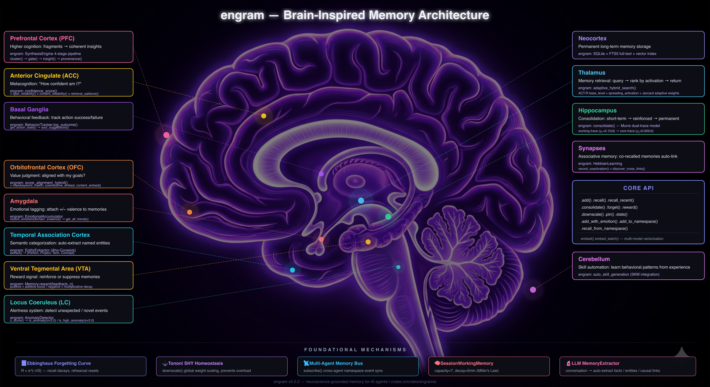

<div align="center">

# Engram — A Cognitive Substrate for AI Agents

[](https://crates.io/crates/engramai)
[](https://docs.rs/engramai)
[](https://www.gnu.org/licenses/agpl-3.0)

**[中文](README-zh.md) | English**

<br>



<br>

*Neuroscience-grounded substrate — memory, emotion, interoception, insight*

*Pure Rust · Single SQLite file · No external services*

</div>

---

Engram is a **cognitive substrate** for AI agents — the underlying machinery that turns an LLM into something that *remembers, feels, and learns* over time. Not a vector DB wrapper. Not a RAG library. A unified storage and computation layer modelled on how biological cognition actually works.

**Memory is the foundation.** Built on published cognitive science models (ACT-R activation, Ebbinghaus forgetting curves, Hebbian + STDP associative learning, dual-trace consolidation) — not vector similarity. The result: frequently-used knowledge stays accessible, unused memories naturally fade, related concepts strengthen each other, and patterns surface as insights.

**And memory is just one subsystem.** On the same substrate, Engram provides:

- 🧠 **Memory** — ACT-R activation, Ebbinghaus decay, Hebbian + STDP associative learning, dual-trace consolidation
- 💚 **Emotional bus** — per-domain valence tracking, drive alignment scoring, behavior feedback, cross-agent subscriptions
- 🧬 **Interoceptive hub** — allostatic load, energy budget, body-state regulation signals
- ✨ **Synthesis engine** — automatic insight extraction from memory clusters with full provenance
- 🤝 **Multi-agent coordination** — shared substrate with namespace isolation

---

## From Neuroscience to Code

Engram isn't "inspired by" neuroscience — it implements specific, published models. Each mechanism maps directly to a biological counterpart:

| 🧠 The Brain | ⚙️ Engram |
|---|---|
| **Prefrontal cortex** — "What's relevant now?" | **ACT-R activation model** — frequency × recency scoring |
| **Hippocampal decay** — "Use it or lose it" | **Ebbinghaus forgetting curves** — exponential decay + spaced rep |
| **Synaptic plasticity** — "Fire together, wire together" | **Hebbian learning** — co-recall builds bidirectional associative links |
| **Spike-timing dependent plasticity** — "Order encodes causality" | **STDP temporal ordering** — A before B → directional link strengthening |
| **Sleep consolidation** — Hippocampus → Neocortex | **Dual-trace consolidation** — "sleep" cycle: replay strong, decay weak |
| **Synaptic homeostasis** (Turrigiano 2008) | **Homeostatic scaling** — bounded link strength, adaptive thresholds |
| **Emotional tagging** — Amygdala modulation | **Emotional bus** — per-domain valence tracking, drive alignment scoring |
| **Insight / "Aha!" moments** — Default mode network | **Synthesis engine** — cluster → gate → generate → provenance-tracked insights |
| **Interoception** — Body-state awareness | **Interoceptive hub** — allostatic load, energy tracking, regulation signals |

---

## The Life of a Memory

```
┌──────────┐
│  Input   │  "Rust 1.75 added async traits"
└────┬─────┘
     │
┌────────▼────────┐
│  Store & Index   │  embed + FTS5 + entity extract
└────────┬────────┘   + type classify (factual)
         │
  ┌──────────────┼──────────────┐
  ▼              ▼              ▼
┌────────────┐ ┌────────────┐ ┌────────────┐
│  Activate  │ │   Forget   │ │    Link    │
│  (ACT-R)   │ │(Ebbinghaus)│ │ (Hebbian)  │
│            │ │            │ │            │
│ recalled   │ │  not used  │ │ co-recalled│
│ 3x today → │ │ for weeks →│ │ with "Rust │
│ activation │ │ activation │ │  async" →  │
│     ▲▲▲    │ │     ▽▽▽    │ │  link ▲▲   │
└──────┬─────┘ └──────┬─────┘ └──────┬─────┘
       │              │              │
       └───────────────┼───────────────┘
                       │
              ┌────────▼────────┐
              │ Consolidation   │  "sleep" cycle
              │  (dual-trace)   │  strong → long-term ✓
              │                 │  weak → decay further ✗
              └────────┬────────┘
                       │
              ┌─────────────┼─────────────┐
              ▼                           ▼
    ┌────────────────┐          ┌────────────────┐
    │   Long-term    │          │   Synthesize   │
    │    Memory      │          │                │
    │   survives     │          │  cluster with  │
    │  indefinitely  │          │  related →     │
    └────────────────┘          │ "Aha!" insight │
                                └────────────────┘
```

---

## Quick Start

```rust
use engramai::{Memory, MemoryType};

// 1. Create memory (just a file path — no services needed)
let mut mem = Memory::new("./agent.db", None)?;

// 2. Store
mem.add("Rust 1.75 introduced async fn in traits",
        MemoryType::Factual, Some(0.8), None, None)?;

// 3. Recall (hybrid: FTS + vector + ACT-R activation)
let results = mem.recall("async traits in Rust", 5, None, None)?;
```

That's it. No Docker, no Redis, no API keys. Just a `.db` file.

<details>
<summary>📚 More examples — LLM extraction, emotional bus, synthesis engine</summary>

### With LLM Extraction

```rust
use engramai::{Memory, OllamaExtractor, AnthropicExtractor};

let mut mem = Memory::new("./agent.db", None)?;

// Use local Ollama for extraction
mem.set_extractor(Box::new(OllamaExtractor::new("llama3.2:3b")));

// Raw text → automatically extracted as structured facts
mem.add(
    "We decided to use PostgreSQL for the main DB and Redis for caching. \
     The team agreed this is non-negotiable.",
    MemoryType::Factual, None, None, None,
)?;
```

### With Emotional Bus

```rust
use engramai::bus::{EmotionalBus, Drive, Identity};

let bus = EmotionalBus::new(&conn);

// Track emotional valence per domain
bus.record_emotion("coding", 0.8, "Successfully shipped feature")?;
bus.record_emotion("coding", -0.3, "CI broke again")?;

// Get trends → coding: net +0.5, trending positive
let trends = bus.get_trends()?;

// Drive alignment — scores how well content aligns with agent's goals
let drives = vec![Drive { text: "Help user achieve financial freedom".into(), weight: 1.0 }];
let identity = Identity { drives, ..Default::default() };
let score = bus.score_alignment(&identity, "revenue increased 20%")?;
```

### With Synthesis Engine

```rust
use engramai::synthesis::types::{SynthesisSettings, SynthesisEngine};

let settings = SynthesisSettings::default();

// Discover clusters → gate-check → generate insights → track provenance
let report = mem.synthesize(&settings)?;

for insight in &report.insights {
    println!("Insight: {}", insight.content);
    println!("From {} memories, confidence: {:.2}",
             insight.provenance.source_count, insight.importance);
}

// Undo a synthesis if the insight was wrong
mem.undo_synthesis(insight_id)?;
```

</details>

---

<details>
<summary>🧠 Implementation Details — Cognitive Science Modules</summary>

### 🔍 Hybrid Search

Three signals fused with configurable weights:

```
Final Score = w_fts × FTS5_score  +  w_vec × cosine_sim  +  w_actr × activation
              (15%)                  (60%)                   (25%)
```

- **FTS5**: BM25 ranking + jieba-rs CJK tokenization — Chinese, Japanese, Korean work out of the box
- **Vector**: Cosine similarity via Nomic, Ollama, or any OpenAI-compatible endpoint
- **ACT-R**: Biases toward memories that are *currently relevant*, not just semantically similar

### 🎯 Confidence Scoring

Two-dimensional: "how relevant?" and "how reliable?" are different questions:
- **Retrieval Salience**: Search score + activation + recency
- **Content Reliability**: Access count + corroboration + consistency
- **Labels**: `high` / `medium` / `low` / `uncertain`

### 🧩 Synthesis Engine (3,500+ lines)

```
Memories → Cluster Discovery → Gate Check → LLM Insight → Provenance → Store
           (4-signal)          (quality)    (templated)    (auditable)
```

1. **Clustering** — 4 signals: Hebbian weight, entity Jaccard, embedding cosine, temporal proximity
2. **Gate** — Minimum cluster size, diversity, density, temporal spread
3. **Insight Generation** — Type-aware LLM prompts (factual patterns, episodic threads, causal chains)
4. **Provenance** — Full audit trail. Insights are reversible (`UndoSynthesis`)

### 💚 Emotional Bus (2,500+ lines)

- **Emotional Accumulator** — Per-domain valence over time. Detects negative trends → suggests SOUL.md updates
- **Drive Alignment** — Cross-language embedding scoring (Chinese SOUL + English content)
- **Behavior Feedback** — Action success/failure rate tracking
- **Subscriptions** — Cross-agent notification on high-importance memories

### 🧬 Interoceptive Hub

- **Allostatic Load** — Tracks cognitive resource expenditure, error rates, fatigue signals
- **Energy Budget** — Resource monitoring with regulation signals (rest, consolidate, alert)
- **Body-State Awareness** — Internal state feeds back into memory consolidation and recall priority

### ⚖️ Synaptic Homeostasis

- **Forgetting as feature** — Ebbinghaus decay = garbage collection
- **Consolidation threshold** — Rising bar as memory count grows
- **Hebbian normalization** — Bounded link strength prevents runaway reinforcement
- **Synthesis pruning** — Insight preserves information; sources can safely decay

</details>

---

## How Engram Compares

Most "AI memory" tools are vector DB wrappers in the same category: store embeddings, retrieve by similarity, add metadata. Engram is in a different category — a **multi-system cognitive substrate** with memory as one of its subsystems.

| | **Vector memory tools** (Mem0, Zep, Letta) | **Engram** |
|--|---|---|
| **Category** | Memory backend / RAG layer | Cognitive substrate |
| **Memory primitive** | Vector + metadata | Activation × decay × association |
| **Forgetting** | Manual TTL / never | Ebbinghaus curves (built-in) |
| **Activation modeling** | ❌ | ACT-R (frequency × recency) |
| **Associative learning** | Partial (graph in Zep) | Hebbian + STDP |
| **Consolidation** | ❌ | Dual-trace (replay + decay) |
| **Insight synthesis** | ❌ | Cluster → gate → LLM → provenance |
| **Beyond memory** | — | Emotional bus, interoception, multi-agent subscriptions |
| **Search** | Vector (+ graph) | FTS5 + vector + ACT-R fusion |
| **Embeddings required?** | Required | Optional |
| **Infrastructure** | Redis/Postgres + API service | Single SQLite file |
| **Language** | Python | Rust |

Not a fair comparison on the "vector retrieval" axis — Engram doesn't try to be a faster vector DB. The point is that vector retrieval alone is the wrong abstraction for an agent that needs to live and evolve over time.

---

## 🏗️ Architecture

```
┌─────────────────────┐
│   Agent / LLM       │
└─────────┬───────────┘
          │
  ┌───────────┼───────────┐
  ▼           ▼           ▼
┌───────────┐ ┌───────────┐ ┌───────────┐
│  Memory   │ │ Emotional │ │  Session  │
│  (core)   │ │   Bus     │ │ Working M.│
└─────┬─────┘ └─────┬─────┘ └───────────┘
      │             │
┌─────┴─────┐       │
▼           ▼       ▼
┌──────────┐ ┌───────────────────┐
│  Hybrid  │ │ Synthesis Engine  │
│  Search  │ │ cluster → gate    │
│FTS+Vec+AR│ │ → insight → log   │
└────┬─────┘ └───────────────────┘
     │
┌────┴───────────────────────────┐
▼        ▼        ▼        ▼
┌──────┐ ┌────────┐ ┌────────┐ ┌────────┐
│ACT-R │ │Ebbing- │ │Hebbian │ │Interoc.│
│decay │ │haus    │ │+ STDP  │ │Hub     │
└──────┘ └────────┘ └────────┘ └────────┘
                    │
                    ▼
              ┌──────────┐
              │  SQLite   │
              │(WAL mode) │
              └──────────┘
```

---

## Substrate Status (v0.4)

Engram is being unified onto a single graph-structured storage substrate — `nodes` + `edges` tables that all subsystems read and write through. This is what makes the "cognitive substrate" framing concrete rather than aspirational.

**Current state (v0.4):**

- ✅ **Unified-substrate reads are default-on.** All retrieval paths (recall, FTS, graph traversal, embeddings, synthesis provenance) go through the new node/edge layer.
- ✅ **Dual-write live.** Every write lands in both legacy tables and the new substrate, so rollback is one config flag away during the soak.
- ⏳ **Phase E (stop legacy writes)** — pending. Legacy tables remain as a fallback while parity is validated in production.
- ⏳ **Phase F (drop legacy schema)** — pending. The legacy tables get removed once Phase E has soaked.

**What this means for you as a user:** the public API hasn't changed. `Memory::new(...)`, `mem.add(...)`, `mem.recall(...)` all work identically. The substrate migration is internal — you get the unified reads automatically, and you can opt out via `MemoryConfig { unified_substrate: false, .. }` if you hit a regression.

For the design details, see the [v0.4 substrate design doc](https://github.com/tonitangpotato/engram-ai/blob/main/.gid/features/v04-unified-substrate/design.md) in the repo.

---

## Memory Types

| Type | Use Case | Example |
|------|----------|---------|
| `Factual` | Facts, knowledge | "Rust 1.75 introduced async fn in traits" |
| `Episodic` | Events, experiences | "Deployed v2.0 at 3am, broke prod" |
| `Procedural` | How-to, processes | "To deploy: cargo build --release, scp, restart" |
| `Relational` | People, connections | "potato prefers Rust over Python for systems" |
| `Emotional` | Feelings, reactions | "Frustrated by the third CI failure today" |
| `Opinion` | Preferences, views | "GraphQL is overengineered for most use cases" |
| `Causal` | Cause → effect | "Skipping tests → prod outage last Tuesday" |

---

<details>
<summary>⚙️ Configuration — Agent presets, embedding providers, search tuning</summary>

### Agent Presets

```rust
use engramai::MemoryConfig;

let config = MemoryConfig::chatbot();             // Slow decay, high replay
let config = MemoryConfig::task_agent();           // Fast decay, low replay
let config = MemoryConfig::personal_assistant();   // Very slow core decay
let config = MemoryConfig::researcher();           // Minimal forgetting
```

### Embedding Configuration

Embeddings are optional. Without them, search uses FTS5 + ACT-R only.

```rust
use engramai::EmbeddingConfig;

// Local Ollama (recommended for privacy)
let config = EmbeddingConfig {
    provider: "ollama".into(),
    model: "nomic-embed-text".into(),
    endpoint: "http://localhost:11434".into(),
    ..Default::default()
};

// Or any OpenAI-compatible endpoint
let config = EmbeddingConfig {
    provider: "openai-compatible".into(),
    model: "text-embedding-3-small".into(),
    endpoint: "https://api.openai.com/v1".into(),
    api_key: Some("sk-...".into()),
    ..Default::default()
};
```

### Search Weight Tuning

```rust
use engramai::HybridSearchOpts;

let opts = HybridSearchOpts {
    fts_weight: 0.15,        // Full-text search contribution
    embedding_weight: 0.60,  // Vector similarity contribution
    activation_weight: 0.25, // ACT-R activation contribution
    ..Default::default()
};
```

</details>

---

<details>
<summary>🤝 Multi-Agent Architecture — Shared memory, namespaces, cross-agent subscriptions</summary>

### Shared Memory with Namespaces

```rust
// Agent 1: coder
let mut coder_mem = Memory::new("./shared.db", Some("coder"))?;

// Agent 2: researcher
let mut research_mem = Memory::new("./shared.db", Some("researcher"))?;

// CEO agent subscribes to all namespaces
let subs = SubscriptionManager::new(&conn);
subs.subscribe("ceo", "coder", 0.7)?;       // Only importance ≥ 0.7
subs.subscribe("ceo", "researcher", 0.5)?;

// Check for new high-importance memories from other agents
let notifications = subs.check("ceo")?;
```

### For Sub-Agents (Zero-Config Sharing)

```rust
// Parent agent creates a memory instance for a sub-agent
// that shares the same DB but with its own namespace
let sub_mem = parent_mem.for_subagent_with_memory("task-worker")?;
```

</details>

---

## Project Structure

```
src/
├── lib.rs                # Public API surface
├── memory.rs             # Core Memory struct — store, recall, consolidate
├── models/
│   ├── actr.rs           # ACT-R activation (Anderson 1993)
│   ├── ebbinghaus.rs     # Forgetting curves (Ebbinghaus 1885)
│   ├── hebbian.rs        # Associative learning (Hebb 1949)
│   └── stdp.rs           # Temporal ordering (Markram 1997)
├── hybrid_search.rs      # 3-signal search fusion (FTS5 + vector + ACT-R)
├── confidence.rs         # Two-dimensional confidence scoring
├── anomaly.rs            # Z-score sliding-window anomaly detection
├── session_wm.rs         # Working memory (Miller's Law, ~7 items)
├── entities.rs           # Rule-based entity extraction (Aho-Corasick)
├── extractor.rs          # LLM-based structured fact extraction
├── interoceptive/
│   ├── types.rs          # Allostatic load, energy budget, body-state types
│   ├── hub.rs            # Interoceptive hub — regulation signals
│   └── regulation.rs     # Adaptive regulation strategies
├── synthesis/
│   ├── engine.rs         # Orchestration: cluster → gate → insight → provenance
│   ├── cluster.rs        # 4-signal memory clustering
│   ├── gate.rs           # Quality gate for synthesis candidates
│   ├── insight.rs        # LLM prompt construction + output parsing
│   ├── provenance.rs     # Audit trail for synthesized insights
│   └── types.rs          # Synthesis type definitions
└── bus/
    ├── mod.rs            # EmotionalBus core (SOUL integration)
    ├── mod_io.rs         # Drive/Identity types, I/O
    ├── alignment.rs      # Drive alignment scoring (cross-language)
    ├── accumulator.rs    # Emotional valence tracking per domain
    ├── feedback.rs       # Action success/failure rate tracking
    └── subscriptions.rs  # Cross-agent notification system
```

---

## Design Philosophy

1. **Grounded in science, not marketing.** Every module maps to a published cognitive science model. ACT-R (Anderson 1993), Ebbinghaus (1885), Hebbian learning (Hebb 1949), STDP (Markram 1997), dual-trace consolidation (McClelland 1995).

2. **Memory ≠ retrieval.** Vector search answers "what's similar?" — memory answers "what's *relevant right now*?" The difference is activation, context, emotional state, and temporal dynamics.

3. **Provenance is non-negotiable.** Every synthesized insight records exactly which memories contributed. Insights can be audited and undone. No black-box "the AI said so."

4. **Zero deployment dependencies.** SQLite (bundled), pure Rust. No external database, no Docker, no Redis. Copy the binary and the .db file — done.

5. **Embeddings are optional.** Works without any embedding provider (FTS5 + ACT-R). Add embeddings for semantic search, but cognitive models work independently.

---

## License

AGPL-3.0-or-later. See [LICENSE](LICENSE) for details.

## Citation

```bibtex
@software{engramai,
  title  = {Engram: A Cognitive Substrate for AI Agents},
  author = {Toni Tang},
  year   = {2026},
  url    = {https://github.com/tonitangpotato/engram-ai},
  note   = {Rust. ACT-R, Hebbian learning, Ebbinghaus forgetting, cognitive synthesis.}
}
```
